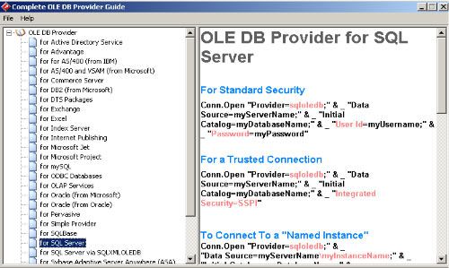



## \_A Complete OLE DB Provider Guide

### Description

Hello guys!!! This submission is a complete OLE DB Provider Guide. Many beginner database programmers out there don't know how to connect there application in defferent database, in lan and even in a remote. This guide will help you a lot coz it gives all example on how to connect to a database using OLE DB Provider. Pls. Pls. Pls. Don't forget to vote this appliction.
 
### More Info
 

             |
---                |---
**Submitted On**   |2003-09-25 05:45:56
**By**             |[Philip  V\. Naparan :\-\)](https://github.com/Planet-Source-Code/PSCIndex/blob/master/ByAuthor/philip-v-naparan.md)
**Level**          |Intermediate
**User Rating**    |4.6 (416 globes from 90 users)
**Compatibility**  |VB 3\.0, VB 4\.0 \(16\-bit\), VB 4\.0 \(32\-bit\), VB 5\.0, VB 6\.0, VB Script, ASP \(Active Server Pages\) , VBA MS Access, VBA MS Excel
**Category**       |[Databases/ Data Access/ DAO/ ADO](https://github.com/Planet-Source-Code/PSCIndex/blob/master/ByCategory/databases-data-access-dao-ado__1-6.md)
**World**          |[Visual Basic](https://github.com/Planet-Source-Code/PSCIndex/blob/master/ByWorld/visual-basic.md)
**Archive File**   |[\_A\_Complet1652861022003\.zip](https://github.com/Planet-Source-Code/philip-v-naparan-a-complete-ole-db-provider-guide__1-48948/archive/master.zip)

